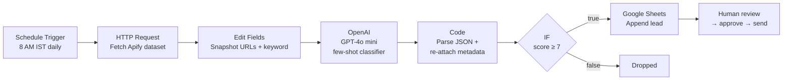

# AI Lead Qualification Engine

An AI pipeline that finds buying-intent posts on LinkedIn, qualifies each one with an LLM, and drops ready-to-review leads into Google Sheets every morning.

Built for **Pixel Pandas**, a design and development agency in Bangalore, to replace a manual prospecting routine that didn't scale.

   

---

## The problem

Every day the team searched LinkedIn by keyword, read ~50 posts, and decided by hand which ones were real sales opportunities. It was slow, repetitive, and noisy.

Keyword search alone doesn't work. In an early test, 2 of 3 posts matching *"looking for a freelance designer"* were designers **looking for work**, the exact opposite of a lead. Telling a buyer from a seller needs judgement, which is where the LLM comes in.

## What it does

1. **Scrapes** LinkedIn posts for 10 buying-intent keywords (Apify)
2. **Snapshots** source metadata (post URL, author profile, matched keyword) before the LLM step
3. **Qualifies** each post with GPT-4o mini using a few-shot classification prompt
4. **Parses** the model's structured JSON: score, service needed, contact method, personalised outreach draft
5. **Filters** to leads scoring 7 or above
6. **Writes** qualified leads to Google Sheets with status `New` for human review

No email or comment is ever sent automatically. A human approves every outreach.

## Architecture



## Results

| Metric | Before | After |
|---|---|---|
| Posts reviewed | ~50/day, by hand | ~100/run, automated |
| Prospecting time | Baseline | ~90% lower |
| False positives (flagged but not a real lead) | ~90% with prompt v1 | Under 10% with prompt v3 |
| Client growth | | **1.5X in 2 months** |

## How qualification works

The model answers one question per post:

> *"Is this person or company trying to pay someone externally to do design or development work for them right now?"*

If the answer isn't a definite yes, the post scores 1. Full rubric in [`docs/scoring-framework.md`](docs/scoring-framework.md), full prompt in [`prompts/system_prompt.md`](prompts/system_prompt.md).

### Prompt iteration (the interesting part)

| Version | Approach | Outcome |
|---|---|---|
| v1 | Rule list + threshold of 4 | 90 of 99 posts passed. The model classified by **topic** ("mentions design") instead of **intent** |
| v2 | Stricter disqualification rules | Still topic-matching. Rules alone didn't change the reasoning |
| v3 | Reframed to a single buyer-intent question, added **real misclassified posts as negative few-shot examples**, a buyer-vs-seller self-check, and raised the threshold to 7 | False positives dropped below 10% |

The lesson: the fix wasn't more rules, it was changing what question the model thought it was answering, and showing it its own past mistakes.

## Engineering problems solved

- **LLM node drops upstream fields.** The OpenAI node only outputs its own response, so post URLs were lost. Fixed by snapshotting metadata in an Edit Fields node before the LLM and re-joining it by item index in the Code node.
- **Unreliable model formatting.** Responses sometimes came wrapped in markdown fences. The parser strips them and skips malformed items instead of failing the run.
- **Apify free-tier limits.** API-triggered runs returned zero results under limited permissions. The workflow reads the last completed dataset instead, decoupling scraping from orchestration.
- **Office vs native Sheets.** n8n can't append to an uploaded `.xlsx`; the template must be saved as a native Google Sheet.

## Tech stack

| Layer | Tool |
|---|---|
| Orchestration | n8n |
| Data collection | Apify (`harvestapi/linkedin-post-search`) |
| LLM | OpenAI GPT-4o mini (structured JSON output) |
| Prompting | Few-shot classification, scoring rubric |
| Parsing | JavaScript (n8n Code node) |
| Review UI | Google Sheets (dropdown statuses, duplicate highlighting) |
| Outreach | YAMM for approved emails, manual LinkedIn DMs |

## Repo structure

```
ai-lead-qualification-engine/
├── README.md
├── workflow/
│   └── lead-hunter.n8n.json      # Importable n8n workflow (credentials stripped)
├── prompts/
│   ├── system_prompt.md          # Classifier rules + few-shot examples
│   └── user_prompt.md            # Per-post template
├── code/
│   └── parse_llm_output.js       # Code node: parse + re-attach metadata
├── docs/
│   ├── setup-guide.md            # Rebuild it yourself, step by step
│   └── scoring-framework.md      # Lead scoring rubric
├── templates/
│   └── lead_tracker_template.xlsx
├── sample-data/
│   └── sample_output.csv         # Illustrative output (fictional data)
└── .env.example
```

## Quick start

1. Import `workflow/lead-hunter.n8n.json` into n8n
2. Add credentials: OpenAI API key, Google Sheets OAuth
3. Replace `YOUR_APIFY_TOKEN` in the HTTP Request node
4. Upload `templates/lead_tracker_template.xlsx` to Drive and **save as Google Sheets**
5. Point the Google Sheets node at your sheet, tab `Leads`
6. Run the Apify actor, then execute the workflow

Detailed walkthrough: [`docs/setup-guide.md`](docs/setup-guide.md)

## Cost

Roughly $0.002 per post with GPT-4o mini. At ~100 posts a day, the LLM costs about $6 a month.

## Roadmap

- **Phase 2:** trigger Apify directly from n8n on a paid plan, deduplicate by post URL inside the workflow, enrich leads with company size and role
- **Phase 3:** proactive outreach. Screenshot prospects' websites and use a vision model to audit UX gaps, so outreach leads with a specific, useful insight

## Guardrails

- Human approval is mandatory before any outreach
- No credentials, tokens, or real lead data are stored in this repo
- Sample data in `sample-data/` is fictional
